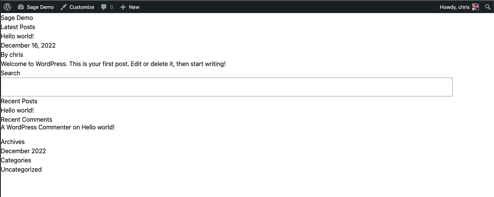

# Installing Roots Sage

## Introduction
Roots Sage is an advanced WordPress starter theme with a modern development workflow. It's built with Laravel Blade, Tailwind CSS and bud.js and is available on the [Roots website](https://roots.io/sage/).

## Requirements
Before running the Sage installation script, you must have the following:

* A fully installed WordPress website on Pantheon. A site that has been deployed but not set up will fail during the installation process.
* [Git](https://git-scm.com/)
* [Composer](https://getcomposer.org/)
* [Terminus](https://pantheon.io/docs/terminus/install/)
* [Terminus Build Tools Plugin](https://github.com/pantheon-systems/terminus-build-tools-plugin)
* [Homebrew](https://brew.sh/)
* [Node.js](https://nodejs.org/en/)
* [jq](https://stedolan.github.io/jq/) (optional, will be installed with Brew if it does not alredy exist)

Note: The script assumes a Mac OS X environment. If you are using a different operating system, you will need to install Sage manually, skip to [How it Works](#how-it-works) to understand what the script is doing so you can recreate the process.

You will also need a copy of the site cloned to your local environment as the script will be run locally. You may use `git clone` or `terminus local:clone site-name` to clone the site. 

## Running the Script

If you have all the above requirements, including a copy of the site locally, `cd` into the root directory of the project and run:

```
composer install-sage
```

## How it Works
The script does a lot of things and each step builds onto the last. You can look at the script in [`private/scripts/sage-theme-install.sh`](../private/scripts/sage-theme-install.sh) if you're interested in the precise commands that are being run. This overview will walk through each step.

### Check Login
The first thing the script will do is check to see if you are logged into Terminus with a `terminus whoami` command. If you are not logged in, the script will end and you will be prompted to log in first.

### Get Site Info
Once we know you are logged into Terminus, the script can run a `terminus site:info` command. From this, the script is able to extract the site name and ID and stores them in variables that we can use in the next step.

### Prompt for Information
If the script was able to identify the site ID and Name, the only thing the script will prompt you for is the name of the theme that you want to create. If it was not able to identify that information, the prompt will ask for Site Name, SFTP username and hostname, and the theme name. Once this information is entered, a confirmation prompt is displayed to ensure that the information is correct. You can type `y` to accept the information or `n` to start the prompts over. If the defaults were used, they will be cleared on a `n` entry, but they will be displayed in their respective prompts.

It's important at this step, when choosing a theme name, to use a name that does **not** include spaces. This name will be used as the directory name and slug for the theme and will be used in bash commands which could error or fail if spaces were entered that it was not expecting.

### Update PHP
The first change the script actually makes is updating the PHP version in the `pantheon.upstream.yml` file to 8.0 as required by Sage. This is done with a `sed` command and immediately pushed on completion.

```yml
php_version: 8.0
```

### Install Sage
The next step is to install Sage. Before this is done, the script will check to see if a directory already exists in `web/app/themes` that matches the name of the theme you entered. If it does, the script will end immediately with a `Directory not empty` error. Otherwise, the script will continue by running the following composer commands:
  
  ```bash
  # Create the new Sage theme
  composer create-project roots/sage $sagedir

  # Require Roots/acorn
  composer require roots/acorn --working-dir=$sagedir

  # Install all the Sage dependencies
  composer install --no-dev --prefer-dist --working-dir=$sagedir
  ```

  Note: In the code snippet above, `$sagedir` refers to the full path of the Sage theme that you are creating. If you are performing the steps manually, you can save that variable name by entering `sagedir=web/app/themes/<your-theme-name>` before running the commands.

Once the Composer processes are done, the NPM processes kick in, The script will run the following to build and install all the Sage NPM dependencies.

```bash
npm install --prefix $sagedir
npm run build --prefix $sagedir
```

When this completes, the `.gitignore` file inside the new Sage theme is modified to remove the line ignoring the `/public/` directory, which should exist on the Pantheon environment.

Then, the newly created theme is added to Git and committed.

```bash
  git add $sagedir
  git commit -m "[Sage Install] Add the Sage theme ${sagename}."
  git push origin master
```

### Adding the Symlink
The next part of the script adds a symlink to point `web/app/cache` to `web/app/uploads/cache`. Sage assumes the `web/app/` directory is writeable, but on Pantheon it is not. However, we can get around this by creating a symbolic link so `web/app/cache` points to `web/app/uploads/cache`. 

First, the script switches to the Pantheon site to SFTP mode, which we will need to make changes to the filesystem before creating the symlink.

```bash
  terminus connection:set $sitename.dev sftp
```

 Then, it checks the existance of and creates the `web/app/uploads` and `web/app/uploads/cache` directories if they do not exist. Then, it connects to the site over SFTP to create the `/files/cache` directory with the following command:

```bash
sftp -P 2222 $sftpuser@$sftphost <<EOF
    cd /files
    mkdir cache
EOF
```

The script then switches back to Git mode so we can commit our symbolic link:

```
  terminus connection:set $sitename.dev git
```

Finally, the symlink is created and committed to Git:

```bash
  cd web/app
  ln -sfn uploads/cache
  git add .
  git commit -m "[Sage Install] Add symlink for /files/cache to /uploads/cache"
  git push origin master
  cd ../..
```

### Update the `composer.json` File
The next step is to update the `composer.json` file to include a `post-install-command` to run `composer install` on _Sage_ every time a `composer install` is run on the site. To do this, the script uses the `jq` command:

```bash
  jq -r '.scripts += { "post-install-cmd": [ "@composer install --no-dev --prefer-dist --ignore-platform-reqs --working-dir=%sagedir%" ] }' composer.json > composer.new.json
  sed -i '' "s,%sagedir%,$sagedir," composer.new.json
  rm composer.json
  mv composer.new.json composer.json
```

If you are doing this manually, you can add the following to your `composer.json` in the `scripts` section:

```json
  "post-install-cmd": [
    "@composer install --no-dev --prefer-dist --ignore-platform-reqs --working-dir=web/app/themes/<your-theme-name>"
  ]
```

Once the change is made, it's committed and pushed to the site.

### Final Steps
The last steps are to activate the theme and verify that it displays as expected.

For WordPress multisites, we need to first Network Enable the theme before it can be activated, so the script runs the following command:

```bash
  terminus wp $sitename.dev -- theme enable $sagename --network
```

Then, the theme is activated:

```bash
  terminus wp $sitename.dev -- theme activate $sagename
```

Finally, the script will open the site in your default browser to verify that the theme is displaying as expected.

```bash
terminus wp -- $sitename.dev theme enable $sagename
```

For single sites, this will produce an error, but it will not exit the script. This is normal and expected. Once we know that the theme is enabled (if applicable), the script will run a `wp theme list` to ensure it appears in the list of themes:

```bash
  terminus wp -- $sitename.dev theme list
```

If you are performing these steps manually, take time to make sure that your new theme shows up in the theme list. If it does not, you may want to retrace your steps.

Assuming it shows up, the next step is to activate the theme. This is also done via WP-CLI.

```bash
  terminus wp -- $sitename.dev theme activate $sagename
```

Once it's activated, the script will attempt to open your site in your default browser. If you are performing these steps manually, you can open the site in your browser and verify that the theme is displaying as expected. It's possible here that you may need to flush your browser cache or use a different browser if you did not see the new sage theme show up. If you continue to see a different default theme, ensure the theme is activated by going to your `wp-admin/themes.php` page. Otherwise, you should see something like this:



If you see a fresh Sage starter theme, the setup worked and you're ready to start building! Refer to the [Sage documentation](https://docs.roots.io/sage/10.x/configuration/) for more information on how to use Sage now that it's been installed.

## Final Thoughts
This script was written with the assumption that you are only using a single Sage theme. If you install multiple Sage themes, you will need to manually update the `composer.json` file to include the `post-install-cmd` for each theme as the script will update the existing entry if one exists already. Additionally, some steps (like creating directories and symlinks) will naturally fail if those things have been done already.
